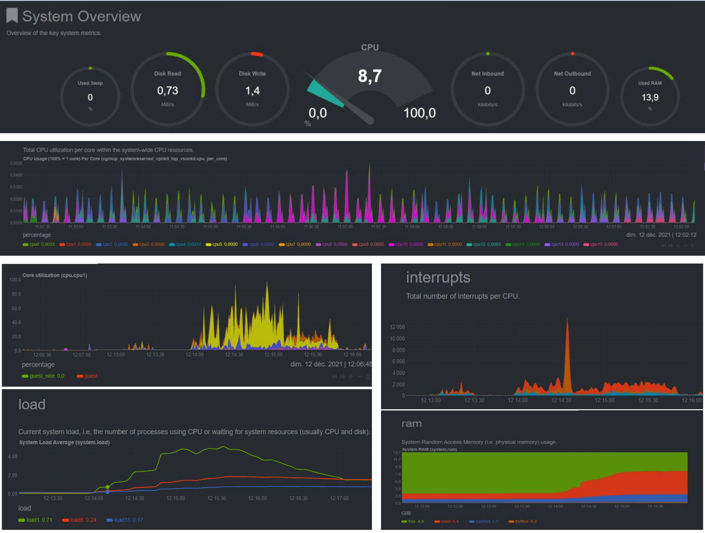

# Netdata

Netdata is a monitoring, visualization, and troubleshooting solution for systems, containers, services, and applications.
It can collect thousands of metrics from systems, hardware, and applications.

## Creating The Netdata environment:

        docker-compose up -d
Netdata consists of a daemon that, when executed, is responsible for collecting and displaying information in real-time.
## Accessing the Netdata environment:
**Go to [http://localhost:19999](http://localhost:19999) to access to Netdata dashboard.**

## Documentation:
Please refer to the official documentation to look at more advanced options: https://learn.netdata.cloud/docs/agent/packaging/docker